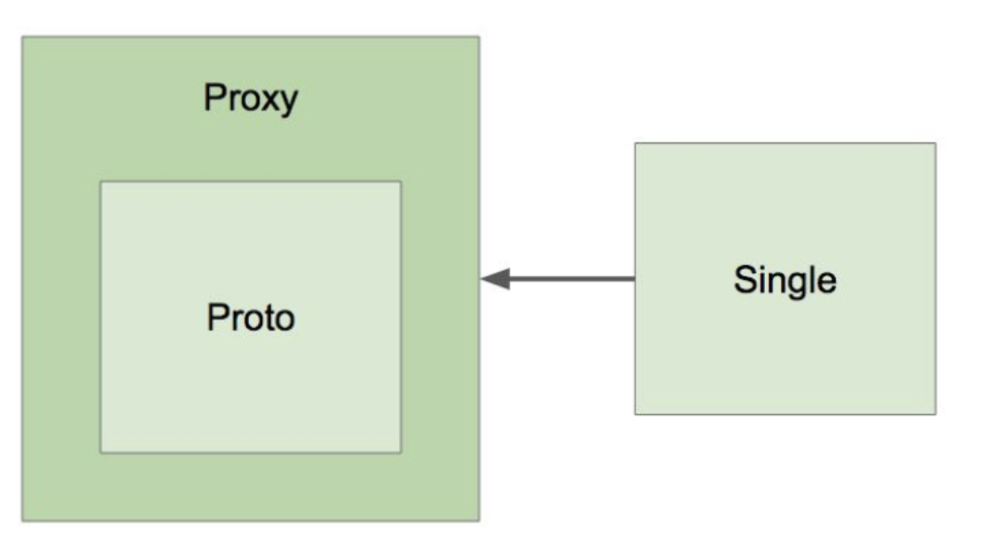

>백기선님의 스프링 프레임워크 핵심 기술 강의 내용을 정리한 내용입니다.
---


# Bean의 Scope
- Singleton

  하나의 Instance를 사용하는 Scope이다.
  ```java
  @Component
  public class singleton {
  
    @Autowired
    private Proto proto;
    
    public Proto getProto() {
      return proto;
    }
  }
  ```
  
  ```java
  @Component
  public class proto {
  
  }
  ```
  
  ```java
  public class AppRunner implements ApplicationRunner {
    @Autowired
    Single single;
    
    @Autowired
    Proto proto;
    
    @Overried
    public void run(ApplicationArguments args) throws Exception {
      System.out.println(proto);
      System.out.println(single.getProto());
      // 두 출력 결과가 같다. = proto는 Singleton이다.
    }
  }
  ```

- prototype
  
  매번 새로운 Instance를 만들어서 사용해야하는 Scope이다.
  
  @Scope("prototype")을 통해 Scope를 설정한다.
  ```java
  @Component
  public class singleton {
  
    @Autowired
    private Proto proto;
    
    public Proto getProto() {
      return proto;
    }
  }
  ```
  
  ```java
  @Component @Scope("prototype")
  public class proto {
  
  }
  ```
  
  ```java
  public class AppRunner implements ApplicationRunner {
    @Autowired
    ApplicationContext ctx;
    
    @Overried
    public void run(ApplicationArguments args) throws Exception {
      System.out.println(ctx.getBean(single.class));
      System.out.println(ctx.getBean(single.class));
      System.out.println(ctx.getBean(single.class));
      // 같은 결과를 출력
      
      System.out.println(ctx.getBean(Proto.class));
      System.out.println(ctx.getBean(Proto.class));
      System.out.println(ctx.getBean(Proto.class));
      // 각각 다른 결과를 출력
    }
  }
  ```

  

# Singleton Scope Bean이 Prototype Scope Bean를 참조
Singleton Scope Bean 내부 Prototype Scope Bean를 참조하는 경우 Prototype Bean은 Update가 되지 않는다.
```java
@Component
public class singleton {

  @Autowired
  private Proto proto
  
  public Proto getProto() {
    return proto;
  }
}
```

```java
@Component @Scope("prototype")
public class proto {

}
```

```java
public class AppRunner implements ApplicationRunner {
  @Autowired
  ApplicationContext ctx;
  
  @Overried
  public void run(ApplicationArguments args) throws Exception {
    System.out.println(ctx.getBean(single.class).getProto());
    System.out.println(ctx.getBean(single.class).getProto());
    System.out.println(ctx.getBean(single.class).getProto());
    // Prototype Bean임에도 불구하고 같은 결과를 출력
  }
}
```

해결 방법은 다음과 같다.
- proxyMode
 
  ```java
  @Component @Scope("prototype", proxyMode = scopedProxyMode.TARGET_CLASS)
  public class proto {
    
  }
  ```
  
  
  
  
  **Class 기반의 Proxy로 Bean을 감싸라.** 라고 설정을 한 것
  Proto Bean을 직접 참조하는 것이 아니라 Proxy를 거치도록 한다. Proto를 직접 참조하면 매번 바꿔줄 수 없기 때문에 Proxy를 거치도록 한다.

- Provider
> (백기선님 의견) Spring Code 수정이 필요하기 때문에 선호하지 않는다.
  
  ```java
  @Component
  public class singleton {
    
    @Autowired
    private ObjectProvider<Proto> proto
    
    public Proto getProto() {
      return proto.getIfAvailable();
    }
  }
  ```


# Singleton 객체 사용시 주의할 점
1. Property가 공유된다.
  - 여러 쓰레드가 Property를 공유하여 값이 동기화 되지 않을 수 있다.
  - 멀티쓰레드 환경에서 Thread-safe한 방법으로 코딩을 해야한다.
2. 모든 Singleton 객체는 ApplicationContext 초기 구동시 Instance가 만들어지므로 Application 구동 시 시간이 좀 걸릴 수 있다.
