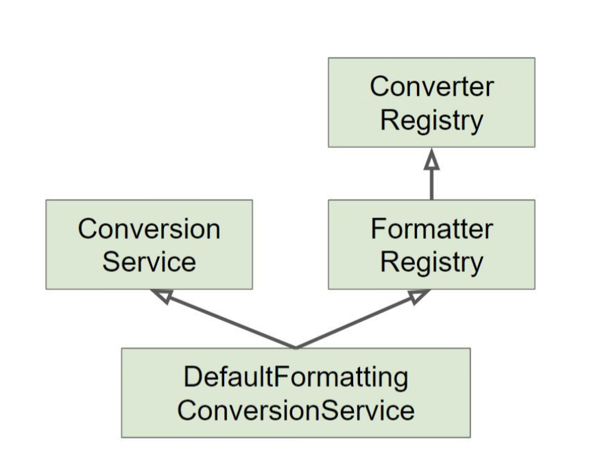

>백기선님의 스프링 프레임워크 핵심 기술 강의 내용을 정리한 내용입니다.
---

# Converter

Spring 3.0부터 [Converter](https://docs.spring.io/spring-framework/docs/current/javadoc-api/org/springframework/core/convert/converter/Converter.html)와 [Formatter](https://docs.spring.io/spring-framework/docs/current/javadoc-api/org/springframework/format/Formatter.html)를 사용할 수 있다. PropertyEditor의 단점들 때문에 Converter가 생겼다.


PropertyEditor의 단점

* Thread-safe하지 않음
* String-Object 변환만 가능


Converter는 S타입을 T타입으로 변환할 수 있는 일반적인 변환기이다. 그리고 상태 정보를 가지고 있지 않기 때문에 Thread-safe하다. 따라서 Bean으로 등록하여 사용해도 무방하며 등록하기 위해서는 [ConverterRegistry](https://docs.spring.io/spring-framework/docs/current/javadoc-api/org/springframework/core/convert/converter/ConverterRegistry.html)에 등록해야 한다. 

ConverterRegistry를 직접 사용할 일은 없고 Spring Boot없이 Spring MVC를 사용 할 경우 다음과 같이 코드를 작성한다.

```java
@Configuration
public class WebConfig implements WebMvcConfigurer {
  
  @Override
  public void addFormatters(FormatterRegistry registry) {
    registry.addConverter(new EventConverter.StringToEventConverter());
    // 이렇게 등록해주면 Spring MVC 설정에 넣어준 Converter가 모든 Controller에 동작한다.
  }
}
```

```java
public class EventConverter {
  
  public static class StringToEventConverter implements Converter<String, Event> {
    
    @Override
    public Event convert(String source) {
      return new Event(Integer.parseInt(source));
    }
  }
  
  public static class EventToStringConverter implements Converter<Event, String> {
    
    @Override
    public String convert(Event source) {
      return source.getId().toString();
    }
  }
}
```

```java
public class Event {

    private Integer id;

    private String title;

    public Event(Integer id) {
        this.id = id;
    }

    public Integer getId() {
        return id;
    }

    public void setId(Integer id) {
        this.id = id;
    }

    public String getTitle() {
        return title;
    }

    public void setTitle(String title) {
        this.title = title;
    }
  
    @Override
    public String toString() {
        return "Event{" +
                "id=" + id +
                ", title='" + title + '\'' +
                '}';
    }
}
```

```java
@RestController
public class EventController {
  
  @InitBinder
  public void init(WebDataBinder webDataBinder) {
    webDataBinder.registerCustomEditor(Event.class, new EventEditor());
    // Event Class를 처리할 DataBinder 등록
  }
  
  @GetMapping("/event/{event}")
  public String getEvent(@PathVariable Event event) {
    System.out.println(event);
    return event.getId().toString();
  }
}
```

```java
@RunWith(SpringRunner.class)
@WebMvcTest
public class EventControllerTest {
  
  @Autowired
  MockMvc mockMvc;
  
  @Test
  public void getTest() throws Exception {
    mockMvc.perform(get("/event/1"))
    				.andExpect(status().isOk())
            .andExpect(content().string("1"));
  }
}
```


# Formatter

[Formatter](https://docs.spring.io/spring-framework/docs/current/javadoc-api/org/springframework/format/Formatter.html)는 PropertyEditor의 대체제이다. Object와 String 간의 변환을 담당하며 문자열을 Locale에 따라 다국화하는 기능도 제공한다. Converter와 같이 [FormatterRegistry](https://docs.spring.io/spring-framework/docs/current/javadoc-api/org/springframework/format/FormatterRegistry.html)에 등록해서 사용할 수 있다.


```java
@Component // Thread-safe하기 때문에 Bean으로 등록 가능
public class EventFormatter implements Formatter<Event> {
  
  @Autowired
  MessageSource messageSource; // Bean으로 등록 가능하기 때문에 다른 Bean도 주입받을 수 있다.
  
  @Override
  public Event parse(String text, Locale locale) throws ParseException {
    return new Event(Integer.parseInt(text));
  }
  
  @Override
  public String print(Event event, Locale locale) {
    messageSource.getMessage("title", locale);
    // locale에 맞는 메세지를 가져오는 기능도 가능하다.
    
    return object.getId().toString();
  }
}
```


EventFormatter를 Bean 등록 없이 사용할 경우

```java
public class EventFormatter implements Formatter<Event> {
  
  @Override
  public Event parse(String text, Locale locale) throws ParseException {
    return new Event(Integer.parseInt(text));
  }
  
  @Override
  public String print(Event event, Locale locale) {
    return object.getId().toString();
  }
}
```

```java
@Configuration
public class WebConfig implements WebMvcConfigurer {
  
  @Override
  public void addFormatters(FormatterRegistry registry) {
    registry.addConverter(new EventFormatter());
  }
}
```


# ConversionService

Converter와 Formatter의 Type을 변환하는 작업은 DataBinder에 대신에 Converter와 Formatter를 활용할 수 있게 해주는 [ConversionService](https://docs.spring.io/spring-framework/docs/current/javadoc-api/org/springframework/core/convert/ConversionService.html)가 이 일을 한다.

PropertyEditor를 DataBinder를 통해 사용했다면 Converter와 Formatter는 ConversionService를 통해 사용하는 것이다.

WebMvcConfigurer Interface를 통해 등록되는 Converter와 Formatter는 ConversionService에 등록이 되는 것이고 ConversionService를 통해 실제 변환하는 작업을 하는 것이다.

ConversionService를 Spring MVC, 빈(value) 설정, SpEL에서 등록하여 사용한다.


ConversionService 구현체 중에 DefaultFormattingConversionService가 있는데 다음과 같은 기능을 한다.

* FormatterRegistry를 구현
* ConversionService를 구현
* 여러 가지 기본 Formatter와 Converter를 등록


# DefaultFormattingConversionService



스프링 부트에서 Web Application의 경우 DefaultFormattingConversionService를 상속하여 만든 WebConversionService를 빈으로 등록해 준다. 그리고 Formatterd와 Converter Bean을 찾아 자동으로 등록하기 때문에 Configurer를 구현한 Config class를 만들지 않아도 된다. Converter와 Formatter을 Bean으로 등록하여 Bean을 찾도록 한다.

```java
public class EventConverter {
  
  @Component
  public static class StringToEventConverter implements Converter<String, Event> {
    
    @Override
    public Event convert(String source) {
      return new Event(Integer.parseInt(source));
    }
  }
  
  @Component
  public static class EventToStringConverter implements Converter<Event, String> {
    
    @Override
    public String convert(Event source) {
      return source.getId().toString();
    }
  }
}
```

```java
@Component
public class EventFormatter implements Formatter<Event> {
  
  @Override
  public Event parse(String text, Locale locale) throws ParseException {
    return new Event(Integer.parseInt(text));
  }
  
  @Override
  public String print(Event event, Locale locale) {
    return object.getId().toString();
  }
}
```

```java
@RunWith(SpringRunner.class)
// @WebMvcTest는 Web과 관련된 Bean만 등록된다.
// Bean으로 등록할 class를 선언하여 사용할 수 있다.
// @WebMvcTest({EventConverter.StringToEventConverter.class, EventController.class})
@WebMvcTest({
  EventFormatter.class, 
  EventController.class})
public class EventControllerTest {
  
  @Autowired
  MockMvc mockMvc;
  
  @Test
  public void getTest() throws Exception {
    mockMvc.perform(get("/event/1"))
    				.andExpect(status().isOk())
            .andExpect(content().string("1"));
  }
}
```


다음과 같은 코드로 등록되어 있는 Converter를 모두 볼 수 있다.

```java
@Component
public class AppRunner implements ApplicationRunner {
  
  @Autowired
  ConversionService conversionService;
  
  @Override
  public void run(ApplicationArguments args) throws Exception {
    System.out.println(conversionService);
  }
}
```


보통 웹과 관련하여 데이터 바인딩을 하기 때문에 백기선님은 데이터 바인딩 방법으로 Formatter를 추천하신다.  Converter를 사용해도 되는데 JPA 같은 경우 Converter가 등록되어 있다.
