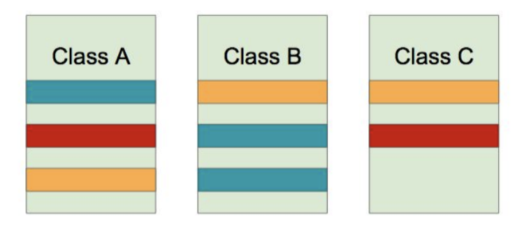
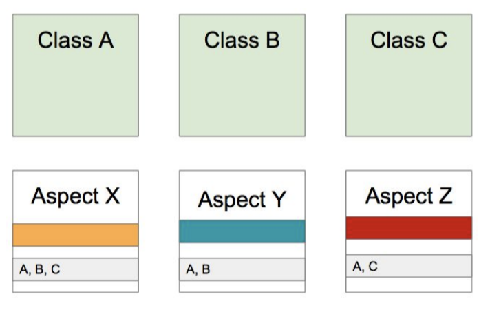

>백기선님의 스프링 프레임워크 핵심 기술 강의 내용을 정리한 내용입니다.
---

# AOP 소개: 개념 소개

Spring은 AOP를 구현체를 제공하며 Java에 만들어져 있는 AOP의 구현체 AspectJ와 연동해서 사용할 수 있는 기능도 제공한다. 또한 Spring 자체에서 구현한 Spring AOP 기능을 활용할 수 있게 해준다. 이 기능을 기반으로 Spring transaction, Cache 등의 여러 기능들이 적용되고 있다.

Aspect-oriendted Programming (AOP)은 OOP를 보완하는 수단으로, 흩어진 Aspect를 모듈화 할 수 있는 프로그래밍 기법이다.

# 흩어진 관심사(Crosscutting Concerns)

여기서 같은 색깔의 것들은 여러 클래스에 거쳐서 나타나는 비슷한 코드들이다.

A, B 그리고 C 모두 Transaction 처리가 필요하다고 생각해보자.

보통 Transaction은 setautocommit을 false로 만들고 Query를 만들어 실행 후 마지막에 Commit 또는 Rollback을 한다. 이러한 코드로 기존의 Service 코드를 감싸야 한다.

성능 관련된 Logging을 한다고 생각해보자. A와 C의 빨강색 부분에 성능상 문제가 있다고 예상되는 경우 실행 시간이 얼마나 걸리는지 Logging을 하는 기능을 A와 C각각에 Method를 추가했다고 생각해보자. 이러한 경우에 비슷한 코드가 A와 C 각각에 추가된다.

위와 같은 경우에 Concerns들에 코드 변경이 일어난 다면 Concerns의 모든 부분의 코드를 고쳐야한다. 즉, 유지보수가 어렵다. 이러한 문제를 AOP가 Aspect를 이용하여 해결한다. Aspect로 흩어져 있는 것들을 모은다.

Aspect X, Y, Z 각각 Concern 별로 Aspect를 만든다. 실제 A,B,C 각각에 들어가 하던 일을 독립적으로 Aspect안에 정의하고 어디에 적용해야 하는지 정보를 개발자가 입력한다. 이 기능을 어디에 적용할지 입력하는 것이다.

이런식으로 해야할 일과 그 일을 어디에 적용해야 하는지를 묶어서 모듈화 하는 것이 AOP이다.

# AOP 주요 개념

* Aspect와 Target
* Advice
* Join point와 Pointcut

Aspect는 하나의 모듈 그 모듈에는 Advice와 Pointcut이 들어간다. Advice는 해야할 일(노랑, 초록, 빨강)들 Pointcut은 어디에 적용하는지(C라는 Class의 D method를 호출할 때만 이 Advice를 적용하겠다.)에 대한 정보를 들고 있다. Target은 적용이 되는 대상(A, B, C Class)이다. Join point는 끼어들 수 있는 지점으로 예를 들어 Method 실행시점할 때 Advice를 끼워 넣는 경우 Method 실행시점(A라는 Class의 B라는 Method를 호출할 때)이 Join point가 된다.

# AOP 구현체

AOP 기능을 구현한 많은 구현체가 있다. [링크](https://www.google.com/url?q=https://en.wikipedia.org/wiki/Aspect-oriented_programming&ust=1580466120000000&usg=AFQjCNG7qcBR8ubKTl2lcglv2MBcJDcHYw&hl=ko)에서 언어별 구현체를 확인 할 수 있다.

Java의 AOP 구현체로 AspectJ가 있다. AspectJ는 다양한 Join point와 많은 기능을 제공한다. 그러나 Spring AOP는 매우 국한적으로 기능을 제공한다.

# AOP 적용 방법

각각의  crosscutting concerns들을 모듈화한 후에 적용하는 방법은 크게 3가지가 있다.

1. **컴파일**
   * Java 파일을 Class 파일로 만들 때 조작이 된 Byte 코드들을 생성
   * A라는 Method를 실행할 때 Hello를 Print하는 Asepct를 실행한다고 가정하면 컴파일이 되면 Class 파일에 Hello를 Print하는 Method가 같이 들어있어야 한다.
   * 로드 타임과 런타임에 성능적인 부하가 없다. 그러나 별도의 컴파일 과정이 필요하다.
2. **로드 타임**
   * A라는 Class를 순수하게 A라는 Class로 컴파일하고 A라는 Class 파일을 로딩하는 시점에 로딩하는 Class 정보를 변경한다. (로드 타임 위빙)
   * Class 로딩 시점에 부하가 있고 로드 타임 위버 설정(Java agent 설정)이 필요하다.
   * AspectJ를 사용할 수 있어 다양한 문법을 사용할 수 있다.
3. **런타임**
   * A라는 Class를 읽어왔고 Spring Application에서 A라는 Class Type의 Bean을 만들 때 A라는 Bean을 감싼 A type의 Proxy Bean을 만든다. 이 Proxy Bean이 실제 A가 가지고 있는 Method를 호출하기 직전에 Hello를 Print하고 Method를 호출한다.
   * 최초 Bean을 만들 때 성능 저하가 발생한다. 그러나 Web에서 요청을 받을 때 성능이 저하되지 않는다. 그리고 문법이 쉽다.
   * 백기선님은 런타임시 위빙을 하는 방법이 현실적이고 널리 쓰게될 방법이라고 한다.
   * 경우에 따라서 AspectJ가 제공하는 다양한 Join point를 사용해야 하는 경우 AspectJ 컴파일러로 컴파일하거나 별도의 Java agent 설정을 통해 로드 타임 위빙을 하는 방법으로 AspectJ와 연동하여 사용할 수 있다.
     컴파일과 로드 타임은 AspectJ를 사용할 때 런타임은 Spring AOP를 다룰 때 사용하게 된다.

