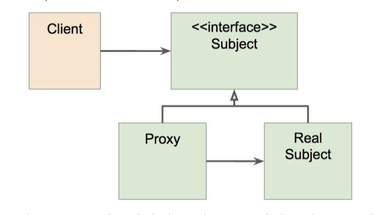

>백기선님의 스프링 프레임워크 핵심 기술 강의 내용을 정리한 내용입니다.
---

# 스프링 AOP: 프록시 기반 AOP

스프링 AOP 특징은 다음과 같다.

1. 프록시 기반의 AOP 구현체
2. 스프링 빈에만 AOP를 적용할 수 있다.
3. 모든 AOP 기능을 제공하는 것이 목적이 아니라, 스프링 IoC와 연동하여 엔터프라이즈 애플리케이션에 가장 흔한 문제에 대한 해결책을 제공하는 것이 목적이다.


# 프록시 패턴



원래 Proxy 패턴은 Interface가 있고 Client는 Interface type으로 Proxy 객체를 사용하게 된다. Proxy 객체는 target 객체를 참조하고 있다. 원래 해야할 일은 Real Subject에 있고 원래 해야할 일을 가지고 있는 객체를 Proxy가 감싸서 실제 Client의 요청을 처리하게 된다.


```java
// Subject
public interface EventService {
  
  void createEvent();
  
  void publishEvent();
  
  viid deleteEvent();
}
```

```java
// Real Subject
@Service
public class SimpleEventService implements EventService {
  
  @Override
  public void createEvent() {
    long begin = System.currentTimeMillis();
    
    try {
      Thread.sleep(1000);
    } catch (InterruptedException e) {
      e.printStackTrace();
    }
    System.out.println("Created an event");
    
    System.out.println(System.currentTimeMillis() - begin);
  }
  
  @Override
  public void publicEvent() {
    long begin = System.currentTimeMillis();
    
    try {
      Thread.sleep(2000);
    } catch (InterruptedException e) {
      e.printStackTrace();
    }
    System.out.println("Published an event");
    
    System.out.println(System.currentTimeMillis() - begin);
  }
  
  @Override
  public void deleteEvent() {
    System.out.println("Delete an event");
  }
}
```

```java
// Client
public class AppRunner implements ApplicationRunner {
  
  @Autowired
  EventService eventService;
  // Interface가 있는 경우 Interface type으로 주입 받는 것이 가장 좋다.
  
  @Override
  public void run(ApplicationArguments args) throws Exception {
    eventService.createEvent();
    eventService.publicEvent();
    eventService.deleteEvent();
  }
}
```

SimpleEventService(Real Subject)의 createEvent와 publicEvent method에 crosscutting concern가 있다.

기존의 코드를 건드리지 않고 실행 시간을 측정하기 위해 Proxy 패턴을 사용해서 문제를 해결할 수 있다.


```java
@Primary
// Client가 EventService를 Autowired할 때 ProxySimpleEventService를 가져다 쓴다.
@Service
public class ProxySimpleEventService implements EventService {
  
  @Autowired
  SimpleEventService simpleEventService;
  
  @Override
  public void createEvent() {
    long begin = System.currentTimeMillis();
    simpleEventService.createEvent();
    System.out.println(System.currentTimeMillis() - begin);
  }
  
  @Override
  public void publishEVent() {
    long begin = System.currentTimeMillis();
    simpleEventService.createEvent();
    System.out.println(System.currentTimeMillis() - begin);
  }
  
  @Override
  public void deleteEvent() {
    simpleEventService.deleteEvent();
  }
}
```

이와 같이 코드를 작성할 때 중복된 코드가 여전히 남아있고 다른 클래스에서도 같은 기능이 필요하다면 모든 클래스에 중복된 코드를 심어야 한다. 객체 관계 또한 복잡해진다.

이러한 문제 때문에 Spring AOP가 등장했다. 동적으로(Runtime 중에) 어떠한 객체를 감싸는 Proxy 객체(Dynamic Porxy)를 만들어 사용한다. 이 방법을 기반으로 Spring IoC Container가 제공하는 방법과 혼합해서 이 문제를 간단하게 해결 할 수 있다. 이 것이 Spring AOP이다.


Spring IoC가 기존 빈을 대체하는 Dynamic Proxy Bean을 만들어 등록 시켜준다.

구체적으로 SimpleEventService가 Bean으로 등록되면 BeanPostProcessor Interface를 구현한 [AbstarctAutoProxyCreator](https://docs.spring.io/spring/docs/current/javadoc-api/org/springframework/aop/framework/autoproxy/AbstractAutoProxyCreator.html)로 [SimpleEventService](https://docs.spring.io/spring/docs/current/javadoc-api/org/springframework/beans/factory/config/BeanPostProcessor.html)을 감싸는 Proxy Bean을 만들어 이 Bean을 SimpleEventService Bean 대신에 등록한다.


# SpringBoot 추가정보

```java
@SpringBootApplication
public class Demospring51Application {
  
  public static void main(String[] args) {
    SpringApplication app = new SpringApplication(Demospring51Application.class);
    app.setWebApplicationType(WebApplicationType.NONE);
    app.run(args);
  }
}
```

SpringBoot에서 위와 같이 코드를 작성하면 웹서버가 작동하지 않기 때문에 속도가 빠르고 자동으로 앱도 끝난다.
