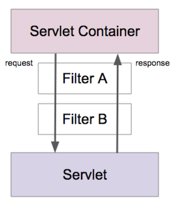

>백기선님의 스프링 웹 MVC 강의 내용을 정리한 내용입니다.
---

**서블릿 리스너**는 웹 애플리케이션에서 발생하는 주요 이벤트를 감지하고 각 이벤트에 특별한 작업이 필요한 경우에 사용할 수 있다.

* 서블릿 컨텍스트 수준의 이벤트
  * 컨텍스트 라이프사이클 이벤트
  * 컨텍스트 애트리뷰트 변경 이벤트
* 세션 수준의 이벤트
  * 세션 라이프사이클 이벤트
  * 세션 애트리뷰트 변경 이벤트

**서블릿 리스너로 어떤걸 할 수 있을까?**

서블릿 컨테이너가 구동될 때 DB 커넥션을 맺어두고 커넥션을 서블릿 애플리케이션에서 만든 여러 서블릿에게 제공해줄 수 있다. 여러개 서블릿에서는 서블릿 컨텍스라는 곳에 들어있는 애트리뷰트에 접근할 수 있다. 서블릿 애트리뷰트의 DB 커넥션을 꺼내서 사용할 수 있다. 

서블릿 컨테이너가 종료되는 시점에는 서블릿 컨텍스트 리스너를 활용해서 DB 커넥션을 정리하는 일도 할 수 있다.

**서플릿 필터**는 들어온 요청을 서블릿으로 보내고 또 서블릿이 작성한 응답을 클라이언트로 보내기 전에 특별한 처리가 필요한 경우에 사용할 수 있다.

서블릿 필터는 체인 형태의 구조로 되어있다.

