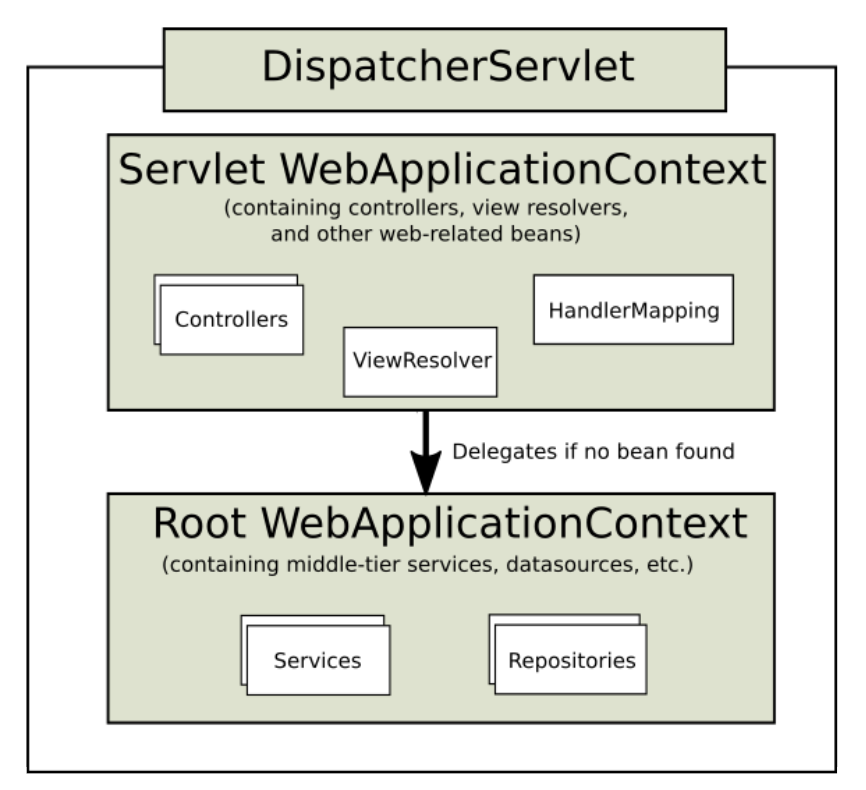

>백기선님의 스프링 웹 MVC 강의 내용을 정리한 내용입니다.
---

**서블릿 애플리케이션에 스프링 연동하기**
1. **서블릿에서 스프링이 제공하는 IoC 컨테이너를 활용**
2. 스프링이 제공하는 서블릿 구현체 DispatcherServlet 사용

**ContextLoaderListener**

1. 서블릿 리스너의 구현체이다.
2. ApplicationContext를 만들어 준다.
3. ApplicationContext를 서블릿 컨텍스트 라이프사이클에 따라 등록하고 소멸시켜준다.
4. 서블릿에서 IoC 컨테이너를 ServletContext를 통해 꺼내 사용할 수 있다.

ContextLoaderListener를 Web.xml에 등록하여 서블릿에서 스프링이 제공하는 IoC 컨테이너를 활용할 수 있다.

# DispatcherServlet

요청 하나를 처리할 때마다 서블릿을 만들면 web.xml에 서블릿 설정이 계속해서 늘어난다. 여러 서블릿에서 공통적으로 처리하고 싶은 부분이 있는데 이러한 부분을 Filter로 해결가능 하지만 디자인 패턴으로 나온 것이 Front Controller 패턴이 있다.

모든 요청을 Controller 하나가 받아 해당 요청을 처리할 핸들러들에게 요청을 분배하는(Dispatch) 것이다.

스프링이 이러한 Dispatch해주는 Front Controller 역할을 해주는 Servlet을 이미 구현했다. 이 Servlet이 DispatcherServlet이다.

DispatcherServlet은 서블릿 컨텍스트에 등록 되어있는 루트 애플리케이션 컨텍스트(사용자가 Web.xml 설정을 통해 만든 애플리케이션 컨텍스트)를 상속받는 웹 어플리케이션 컨텍스트를 만든다.

이렇게 상속받아 만드는 이유는 루트 애플리케이션 컨텍스트는 다른 여러 Servlet들이 공유해서 사용할 수 있다. 그러나 DispatcherServlet이 만든 웹 애플리케이션 컨텍스트는 이 DispatcherServlet안에서만 사용할 수 있도록 Scope이 한정되어 있다. 다른 DispatcherServlet에서는 이 DispatcherServlet을 모른다.

DispatcherServlet를 여러개 만들어야 하고 Bean들을 공유하여 사용해야 하는 경우를 커버하기 위해 상속구조를 만들어 사용한다.

루트 웹 애플리케이션 컨텍스트에는 Web과 관련된 Bean이 없다. Service와 Repositories는 다른 DispatcherServlet들도 공용으로 사용할 수 있는 자원이기 때문에 존재하고 Web과 관련된 Bean은 다른 DispatcherServlet들이 공유하지 않기 때문에 상속하여 구현된 DispatcherServlet에 존재한다.
