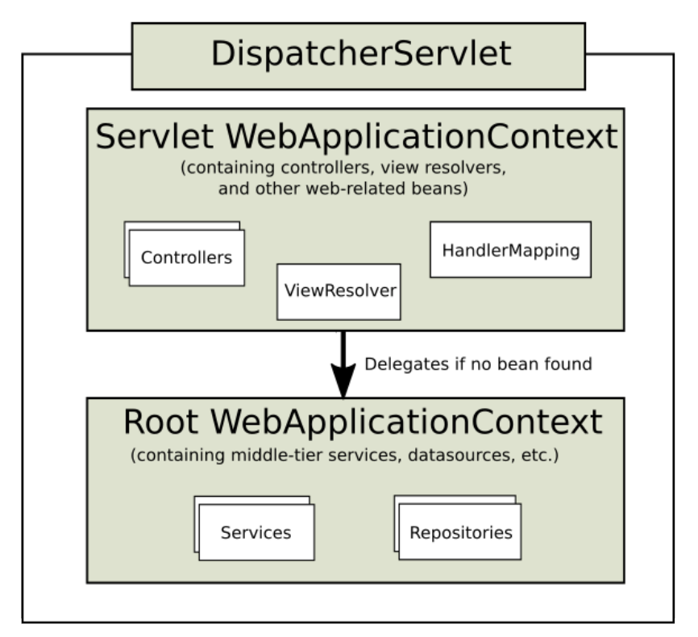

>백기선님의 스프링 웹 MVC 강의 내용을 정리한 내용입니다.
---

**서블릿 애플리케이션에 스프링 연동하기**

1. 서블릿에서 스프링이 제공하는 IoC 컨테이너를 활용
2. **스프링이 제공하는 서블릿 구현체 DispatcherServlet 사용**


```java
@RestController
public class HelloController {
  
  @Autowired
  HelloService helloService;
  
  @GetMapping("/hello")
  public String hello() {
    return "Hello, " + helloService.getName();
  }
}
```

```java
@Service
public class HelloService {
  
  public String getName() {
    return "keesun";
  }
}
```

위 Controller를 사용하고 싶다면 Spring MVC를 사용해야하고 Spring MVC를 사용하려면 요청을 해당 핸들러로 Dispatch해줄 수 있는 Annotation을 이해하는 return을 HttpResponse로 만들어줄 수 있는 DispatcherServlet를 사용해야 한다.




Controller는 DispatcherServlet이 만드는 ApplicationContext에 등록되야하고 Service는 ContexctLoaderListener가 만드는 ApplicationContext에 등록되야 한다.

각 ApplicationContext에 필요한 Bean만 Scan되도록 설정이 필요하다.


모든 Bean을 DispatcherServlet이 만드는 ApplicationContext에 등록하여 사용할 수도 있고 ContextLoaderListener가 만드는 ApplicationContext에 등록하여 사용할 수도 있다.


서블릿에 스프링을 연동하는 구조는 서블릿 컨테이너가 먼저 뜨고 서블릿 컨테이너 안에 등록되는 서블릿 애플리케이션에 스프링을 연동하는 방법이다. 서블릿 컨텍스트 안에 스프링이 들어간 구조(톰캣안에 스프링을 넣은 구조)라면 스프링 부트는 스프링이라는 자바 애플리케이션안에 톰캣이 들어가있는 형태이다. 스프링 부트 애플리케이션이 먼저 자바 애플리케이션으로 뜨고 그 안에 톰캣이 내장서버로 뜬다. 서블릿을 내장된 톰캣안에 DispatcherServlet을 코드로 등록한다.

