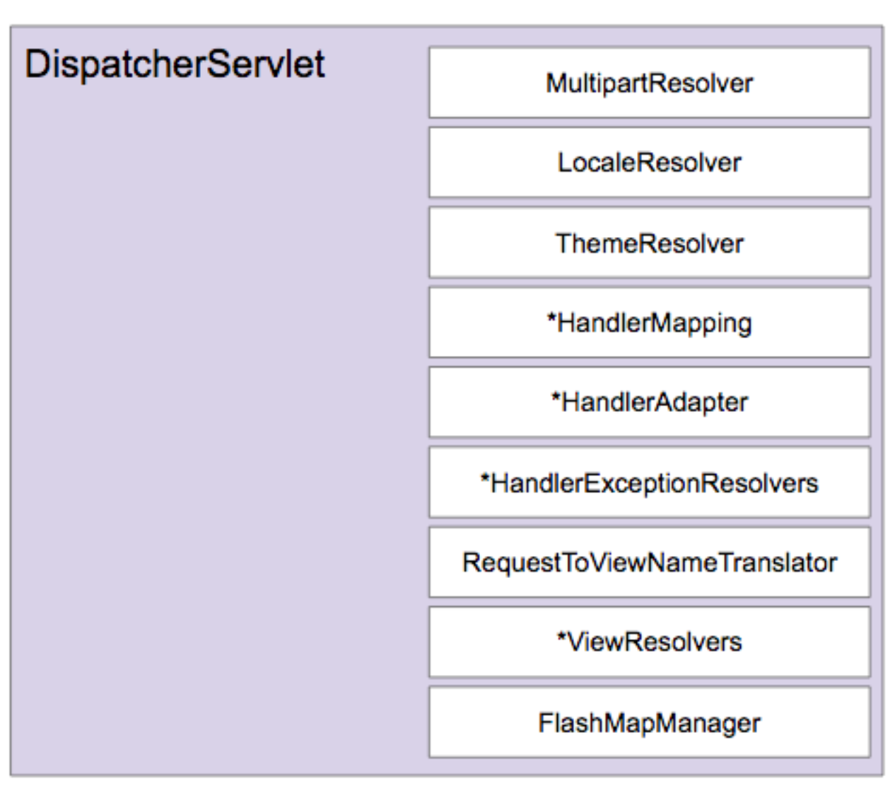

>백기선님의 스프링 웹 MVC 강의 내용을 정리한 내용입니다.
---

**DispatcherServlet이 사용하는 여러가지 Interface**


  

\* 표시는 여러개의 Bean들을 사용하는 인터페이스


**DispatcherServlet의 기본 전략**

* DispatcherServlet.properties에 기본 전략이 설정되어 있다.
* 특정 타입에 해당하는 빈을 찾고 없으면 기본 전략을 사용한다.


MultipartResolver와 LocalResolver는 요청이 DispatcherServlet으로 들어왔을 때 요청을 분석하는 단계에서 사용한다.


**MultipartResolver**

* 파일 업로드 요청 처리에 필요한 인터페이스
* HttpServletRequest를 MultipartHttpServletRequest로 변환해주어 요청이 담고 있는 File을 꺼낼 수 있는 PI 제공
* 기본 DispatcherServlet에는 아무런 MultipartResolver Bean을 등록하지 않는다. SpringBoot에서는 기본적으로 하나(StandardServletMultipartResolver)가 등록되어 있어 아무런 Bean 설정을 하지 않아도 File 업로드를 처리하는 Handler를 쉽게 만들 수 있다.


**LocalResolver**

* Client의 Locale(위치) 정보를 파악하는 인터페이스
* 지역정보에 따라서 MessageSource에서 적절한 언어에 해당하는 Message로 Message Key 값을 Resolving해서 지역언어의 Message로 보여줄 수 있다.
* 기본 전략(AcceptHeaderLocaleResolver)은 요청의 accept-language를 보고 판단한다.


**ThemeResolver**

* Application에 설정된 테마를 파악하고 변경할 수 있는 인터페이스
* [참고](https://memorynotfound.com/spring-mvc-theme-switcher-example/ )


**HandlerMapping**

* 요청을 처리할 Handler를 찾는 인터페이스
* 요청을 처리해야할 Method 또는 Class 정보를 담고 있는 Handler 객체를 Return한다.
* 기본적으로 두개가 등록이 되어 있다.
  1. RequestMappingHandlerMapping
     * Annotation을 기반으로 Handler를 찾는다.
  2. BeanNameUrlHandlerMapping
     * Bean 이름을 기반으로 Handler를 찾는다.


**HandlerAdapter**

* HandlerMapping이 찾아낸 Handler를 처리하는 인터페이스
* 스프링 MVC 확장력의 핵심
* HttpRequestHandlerAdapter, RequestMappingHandlerAdapter, SimpleControllerHandlerAdapter가 기본적으로 등록되어 있다.


**HandlerExceptionResolvers**

* 요청 처리 중에 발생한 에러 처리하는 인터페이스


**ReqeustToViewNameTranslator**

* 핸들러에서 뷰 이름을 명시적으로 리턴하지 않은 경우, 요청을 기반으로 뷰 이름을 판단하는 인터페이스

```java
@Controller
public class HelloController {
    
    @GetMapping("/sample")
    public void sample() {}
}
```


**ViewResolver**

* 뷰 이름(string)에 해당하는 뷰를 찾아내는 인터페이스


**FlashMapManager**

* FlashMap 인스턴스를 가져오고 저장하는 인터페이스
* 화면에서 Refresh할 때 같은 데이터를 또 보내지 않도록 방지 (Form Submission을 방지)하기 위한 일종의 패턴(Redirect)이다.
  Post 요청을 받으면 Form Submission을 하는 것이 아니라 Get 요청으로 Redirect한다.
* Redirect할 때 데이터 전송을 편하게 하기 위하여 FlashMapManager를 쓴다.
